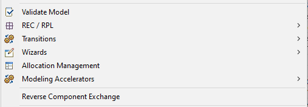
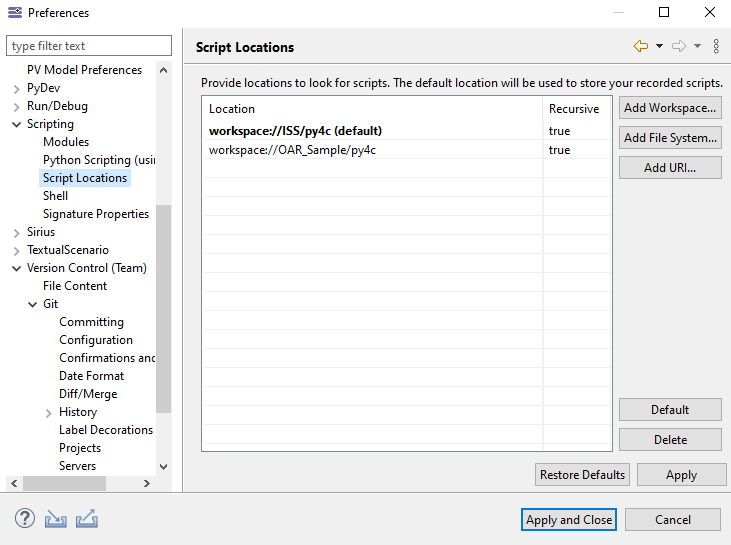

# Tool to reverse Source and Target of a Component Exchange
This Python4Capella script adds a contextual menu which
allows to exchange source and target ports of a Component Exchange.

The script should be in a folder added in the Script Locations of in Scripting preferences

